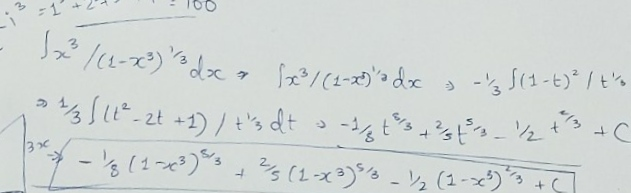

<!doctype html>
<html lang="en">
<head>
  <meta charset="utf-8" />
  <meta name="viewport" content="width=device-width,initial-scale=1" />
  <title>Dhruv Saxena — Portfolio</title>
  
</head>
<body>

  

    <a onclick="router('home', 'profile')">Profile</a>
    <a onclick="router('home', 'experience')">Experience</a>
    <a onclick="router('home', 'projects')">Projects</a>
    <a onclick="router('home', 'education')">Education</a>
    <a onclick="router('home', 'skills')">Skills</a>
    <a onclick="router('home', 'accomplishments')">Accomplishments</a>
    <a onclick="router('blog', null)">Blogs</a>
  

  <header id="banner">
    
  </header>

  <main class="wrap">
    
    <!-- === MAIN PAGE VIEW === -->
    

      <!-- PROFILE -->
      <section id="profile">
        

          

            
          

          

            

              <h1 id="displayName">Dhruv Saxena</h1>
              
15

            

            

              A dedicated ResearchGate Fellow with experience in AI development, scientific writing and building AI tools (ImagoPedia). Collaborations include IIT-BHU, UPPEN & Cambridge.
            

            
<strong>Location:</strong> Varanasi, India &nbsp; • &nbsp; <strong>Email:</strong> <a href="mailto:dhruvisgood13@gmail.com">dhruvisgood13@gmail.com</a>

            
<strong>LinkedIn:</strong> dhruv-saxena-3a2b4e7a &nbsp; • &nbsp; <strong>GitHub:</strong> github.com/dhruvisgood

          

        

      </section>

      <!-- EXPERIENCE -->
      <section id="experience">
        

            <h2>Experience</h2>
            
<button class="btn-xs" onclick="toggleForm('expForm')">+ Add</button>

        

        

           <h4>Add Experience</h4>
           

             <input id="in_exp_title" placeholder="Title (e.g. Researcher)" />
             <textarea id="in_exp_text" rows="2" placeholder="Description"></textarea>
             <input id="in_exp_img" type="file" accept="image/*" />
             <button class="primary" onclick="addData('experience', 'in_exp_title', 'in_exp_text', 'in_exp_img')">Save</button>
           

        

        

      </section>

      <!-- PROJECTS -->
      <section id="projects">
        

            <h2>Projects</h2>
            
<button class="btn-xs" onclick="toggleForm('projForm')">+ Add</button>

        

        

           <h4>Add Project</h4>
           

             <input id="in_proj_title" placeholder="Project Name" />
             <textarea id="in_proj_text" rows="3" placeholder="Project Details"></textarea>
             <input id="in_proj_img" type="file" accept="image/*" />
             <button class="primary" onclick="addData('projects', 'in_proj_title', 'in_proj_text', 'in_proj_img')">Save</button>
           

        

        

      </section>

      <!-- EDUCATION -->
      <section id="education">
        

            <h2>Education</h2>
            
<button class="btn-xs" onclick="toggleForm('eduForm')">+ Add</button>

        

        

           <h4>Add Education</h4>
           

             <input id="in_edu_title" placeholder="School / Institution" />
             <textarea id="in_edu_text" rows="2" placeholder="Details (Grades, Activities)"></textarea>
             <button class="primary" onclick="addData('education', 'in_edu_title', 'in_edu_text')">Save</button>
           

        

        

      </section>

      <!-- SKILLS -->
      <section id="skills">
        

            <h2>Skills</h2>
            
<button class="btn-xs" onclick="toggleForm('skillForm')">+ Add</button>

        

        

           <h4>Add Skill</h4>
           

             <input id="in_skill_name" placeholder="Skill Name (e.g. Python)" />
             <input id="in_skill_val" type="number" min="0" max="100" placeholder="Percent (0-100)" />
             <button class="primary" onclick="addSkill()">Save</button>
           

        

        

      </section>

      <!-- ACCOMPLISHMENTS -->
      <section id="accomplishments">
        

            <h2>Accomplishments</h2>
            
<button class="btn-xs" onclick="toggleForm('accForm')">+ Add</button>

        

        
Click items for details.

        

           <h4>Add Accomplishment</h4>
           

             <input id="in_acc_title" placeholder="Title (e.g. Gold Medalist)" />
             <textarea id="in_acc_text" rows="3" placeholder="Detailed description for the modal popup"></textarea>
             <button class="primary" onclick="addData('accomplishments', 'in_acc_title', 'in_acc_text')">Save</button>
           

        

        <ul id="accList" class="acc-list"></ul>
      </section>

      <!-- CONTACT -->
      <section id="contact">
        <h2>Contact</h2>
        <form action="https://formspree.io/f/xzzkvjjk" method="POST">
          

            <input name="name" type="text" placeholder="Your name" required />
            <input name="email" type="email" placeholder="Your email" required />
            <textarea name="message" rows="5" placeholder="Message" required></textarea>
            <button class="primary" type="submit">Send message</button>
          

        </form>
      </section>

    
<!-- End HomeView -->

    <!-- === BLOG PAGE VIEW === -->
    

      <section>
        

          <h1 style="margin:0;">Blogs</h1>
          <button class="btn-xs" onclick="router('home', null)">← Back to Home</button>
        

        
        

           <button class="btn-xs" onclick="toggleForm('blogForm')">+ New Blog Post</button>
           

             

               <input id="in_blog_title" placeholder="Blog Title" />
               <textarea id="in_blog_text" rows="6" placeholder="Content"></textarea>
               <input id="in_blog_img" type="file" accept="image/*" />
               <button class="primary" onclick="addData('blogs', 'in_blog_title', 'in_blog_text', 'in_blog_img')">Publish</button>
             

           

        

        

      </section>
    

  </main>

  <!-- MODAL FOR ACCOMPLISHMENTS -->
  

    

      ×
      <h3 id="mTitle" style="margin-top:0"></h3>
      

    

  

  <!-- ADMIN TOGGLE -->
  

    <button id="lockBtn" title="Admin Access">🔒</button>
  

</body>
</html>
