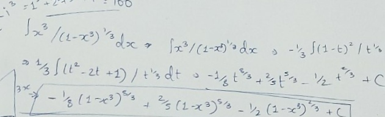

<!doctype html>
<html lang="en">
<head>
  <meta charset="utf-8" />
  <meta name="viewport" content="width=device-width,initial-scale=1" />
  <title>Dhruv Saxena — Portfolio (admin-enabled)</title>
  
</head>
<body>

  <button id="adminOpenBtn" title="Admin">⚙</button>

  

    <a href="#profile">Profile</a>
    <a href="#experience">Experience</a>
    <a href="#education">Education</a>
    <a href="#skills">Skills</a>
    <a href="#accomplishments">Accomplishments</a>
    <a href="#blogs" id="blogsLink">Blogs</a>
  

  <!-- banner: drop banner.jpg in same folder to show an actual image -->
  <header id="banner">
    
  </header>

  <main class="wrap" id="mainContent">

    <!-- PROFILE -->
    <section id="profile">
      

        

          <!-- drop profile.jpg in same folder to show -->
          
        

        

          

            <h1 id="displayName">Dhruv Saxena</h1>
            
15

          

          

            A dedicated ResearchGate Fellow with experience in AI development, scientific writing and building AI tools (ImagoPedia). Collaborations include IIT-BHU, UPPEN & Cambridge.
          

          
<strong>Location:</strong> Varanasi, India &nbsp; • &nbsp; <strong>Email:</strong> <a href="mailto:dhruvisgood13@gmail.com">dhruvisgood13@gmail.com</a>

          
<strong>LinkedIn:</strong> dhruv-saxena-3a2b4e7a &nbsp; • &nbsp; <strong>GitHub:</strong> github.com/dhruvisgood

        

      

    </section>

    <!-- EXPERIENCE -->
    <section id="experience">
      <h2>Experience</h2>
      

    </section>

    <!-- EDUCATION -->
    <section id="education">
      <h2>Education</h2>
      

    </section>

    <!-- SKILLS -->
    <section id="skills">
      <h2>Skills</h2>

      

    </section>

    <!-- ACCOMPLISHMENTS -->
    <section id="accomplishments">
      <h2>Accomplishments</h2>
      

    </section>

    <!-- BLOGS (link goes to dedicated blog-page below) -->
    <section id="blogs">
      <h2>Blogs</h2>
      

    </section>

    <!-- CONTACT -->
    <section id="contact">
      <h2>Contact</h2>
      <form action="https://formspree.io/f/xzzkvjjk" method="POST">
        

          <input name="name" type="text" placeholder="Your name" required />
          <input name="email" type="email" placeholder="Your email" required />
          <textarea name="message" rows="5" placeholder="Message" required></textarea>
          <button class="primary" type="submit">Send message</button>
        

      </form>
    </section>

  </main>

  <!-- Dedicated blog page view (single-page app style) -->
  

    <button id="backToSite" class="primary" style="margin-bottom:12px;">← Back to site</button>
    <h1>Blogs</h1>
    

    

      

        <input id="bpTitle" type="text" placeholder="Blog title" />
        <textarea id="bpText" rows="4" placeholder="Blog content / summary"></textarea>
        <input id="bpMedia" type="file" accept="image/*,video/*" />
        
<button id="bpAdd" class="primary">Add Blog</button>

      

    

  

  <!-- Admin modal -->
  

    

    

      <h3>Admin access</h3>
      

        

          <input id="adminPassInput" type="password" placeholder="Enter passkey" />
        

        

          <button id="adminUnlockBtn" class="primary">Unlock</button>
          <button id="adminCloseBtn">Close</button>
        

      

      
Admin passkey is required to reveal editing controls. (Hint: provided by site owner.)

      

      

        <strong>GitHub sync:</strong> If you want all changes to be saved to the GitHub repository for EVERYONE to see, set the following variables in the page (server-side or by a secure build process):
        <pre style="white-space:pre-wrap;">window.API_CLASSIC = 'ghp_...';
window.GITHUB_OWNER = 'your-username';
window.GITHUB_REPO = 'your-repo';
window.GITHUB_BRANCH = 'main';
window.GITHUB_DATA_PATH = 'data/site-data.json';</pre>
        <em>Warning:</em> storing a classic token in client-side JS is insecure. Prefer using a server or GitHub Actions to perform commits securely.
      

    

  

</body>
</html>
